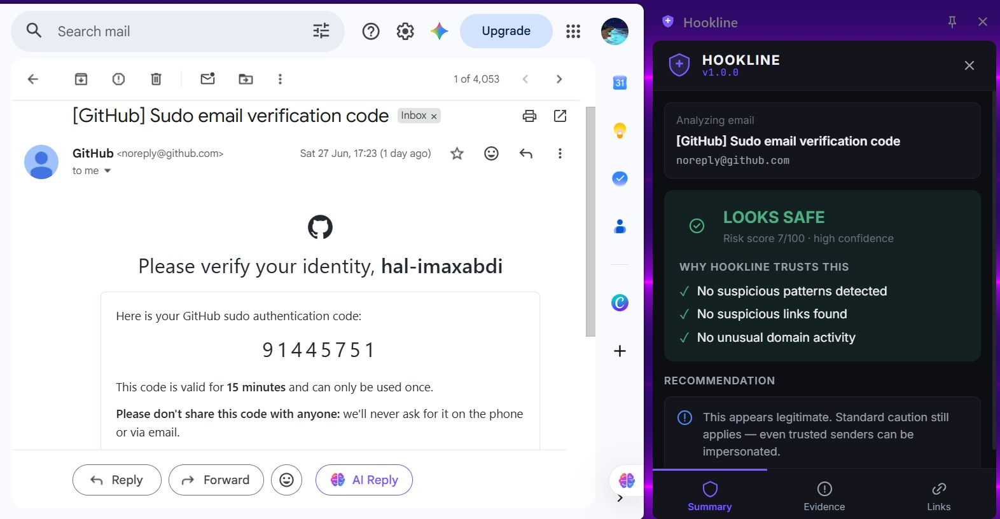
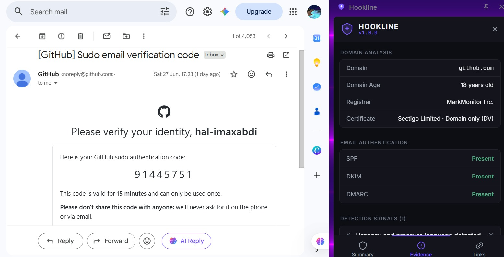
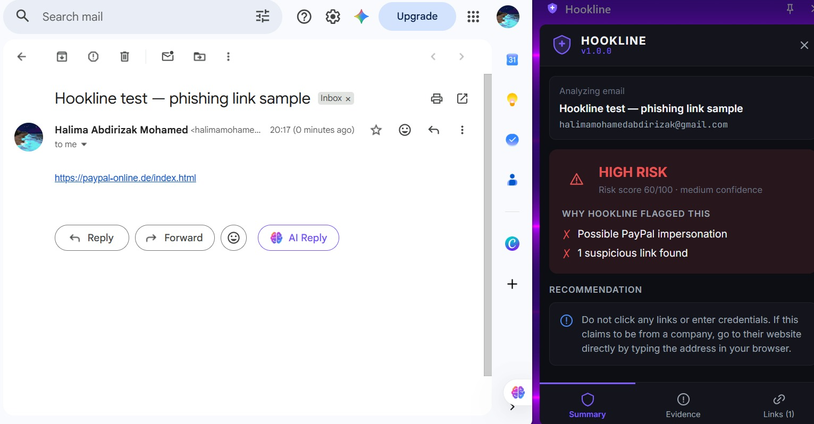
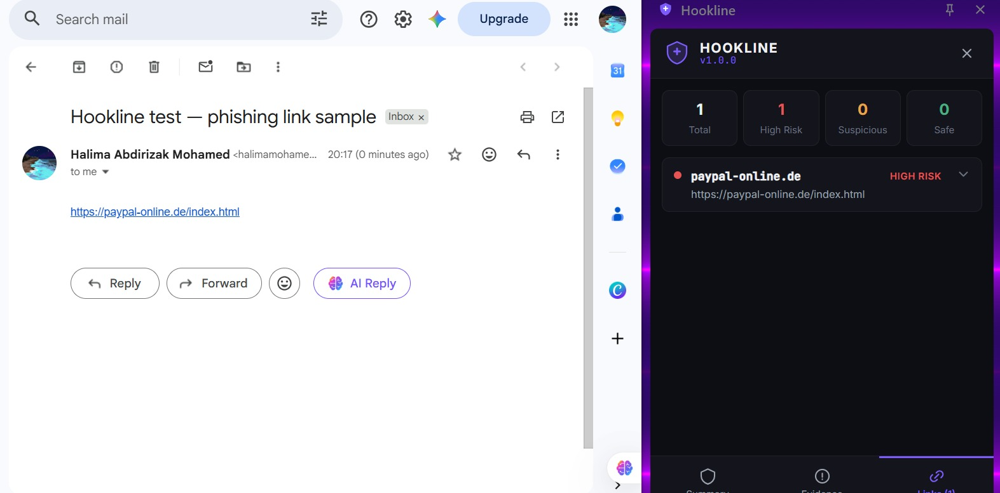

# Hookline

A Chrome extension that checks Gmail emails and URLs for phishing indicators — typosquatting, brand impersonation, homoglyphs, suspicious domains, mismatched links — and explains *why* it flagged something instead of just giving a score.

> **Disclaimer:** Personal project. Will miss real attacks and occasionally flag legitimate sites. Not a substitute for proper security tooling.

---

## What it checks

**Any URL / webpage:**
- Typosquatting against ~24 commonly-impersonated brands (leetspeak, fat-finger, edit-distance)
- Homoglyph attacks (e.g. Cyrillic "а" standing in for Latin "a")
- Brand names embedded in a domain that isn't the real one (`amazon-security-update.net`)
- Suspicious TLDs, IP-address hosts, excessive subdomains, unusually long/hyphenated domains
- Domain age, registrar, SSL certificate type — *requires local backend (see Setup)*

**Gmail emails (additionally):**
- Sender vs. Reply-To mismatch
- Urgency/pressure language ("verify your account within 24 hours")
- Credential-harvesting phrasing ("enter your password to continue")
- Every link in the body, individually, with same-org comparison against the sender's domain

Every flag shows a plain-language reason in the **Evidence** tab — not just a score.

<details>
<summary><strong>What it does NOT do</strong></summary>

- **Does not visit the destination page** — all detection is lexical (domain/URL pattern matching) plus optional WHOIS/DNS/SSL lookups; it never fetches the link to see what's there
- **No deny-list or threat-intel feed** — no Safe Browsing / VirusTotal integration; a brand-new malicious domain with no typosquatting pattern can slip through
- **DKIM checking is best-effort** — probes common selector names via DNS; reports "unknown" if none match, not "missing" — it genuinely can't tell either way without the actual signed message
- **Gmail web only** — no Outlook, no other mail client, no mobile
- **Depends on Gmail's current DOM** — Gmail doesn't expose a public API, so Hookline reads the rendered page directly; if Google changes their markup, extraction can silently break until selectors are updated (happened once during development)
- **Backend is local and optional** — without it you still get all lexical checks, but no domain age, registrar, or SSL data

</details>

---

## Performance

Evaluated against a public Kaggle phishing-URL dataset — balanced 50k sample (25k phishing / 25k legitimate), lexical engine only:

| Metric | Result |
|---|---|
| Detection rate (recall) | 40.5% — caught 10,074 of 24,888 phishing URLs |
| False-positive rate | 12.7% — wrongly flagged 3,166 of 24,991 safe URLs |
| Precision | 76.1% |
| Accuracy | 64.0% |
| F1 score | 0.528 |

A few notes on these numbers:
- **Lexical engine only** — no backend WHOIS/DNS/SSL enrichment (impractical to run against 50k domains with public rate limits). The live extension with the backend running performs better on individual emails.
- The 40.5% recall reflects that many phishing URLs in datasets are hosted on compromised legitimate domains — outside what pure lexical analysis can catch.
- **The 12.7% false-positive rate is the most actionable number** and the main thing to improve next.

Reproduce it yourself:
```bash
cd extension
npm run eval -- path/to/dataset.csv
```

---

## Screenshots

**Legitimate email (GitHub 2FA) — correctly cleared:**

<table><tr>
<td></td>
<td></td>
</tr>
<tr><td>Summary tab</td><td>Evidence tab — 18-year-old domain, SPF/DKIM/DMARC all present</td></tr>
</table>

**Test phishing link (`paypal-online.de`) — correctly flagged:**

<table><tr>
<td></td>
<td></td>
</tr>
<tr><td>Summary tab</td><td>Links tab</td></tr>
</table>

---

## Setup

### Backend (optional — adds domain age, registrar, SSL data)

```bash
cd backend
python -m venv venv
venv\Scripts\activate          # Windows
# source venv/bin/activate     # macOS/Linux
pip install -r requirements.txt
uvicorn main:app --reload --port 8000
```

Verify it's running: `http://localhost:8000/health` → `{"status":"ok"}`

### Extension

```bash
cd extension
npm install
npm run build
```

In Chrome: `chrome://extensions` → enable **Developer mode** → **Load unpacked** → select `extension/dist`

Open Gmail, open an email, click the Hookline icon in the toolbar.

---

## Tech stack

| Layer | Stack |
|---|---|
| Extension UI | React, TypeScript, Tailwind CSS, Chrome Manifest V3 (side panel) |
| Content script | Reads Gmail's rendered DOM to extract subject, sender, reply-to, body, links |
| Background worker | Runs analysis, persists results in `chrome.storage.session` |
| Backend (optional) | Python + FastAPI — RDAP, DNS (SPF/DKIM/DMARC), SSL inspection |

---

## Project structure

```
hookline/
├── extension/
│   ├── src/
│   │   ├── background/   # service worker — analysis + caching
│   │   ├── content/      # Gmail DOM extraction
│   │   ├── shared/       # urlAnalyzer, emailAnalyzer, riskEngine, detection rules — pure, unit-tested
│   │   └── sidebar/      # React UI (Summary / Evidence / Links tabs)
│   ├── eval/             # dataset evaluation harness
│   └── tests/            # unit tests for the analyzers
├── backend/              # FastAPI domain-intelligence service
└── docs/
```

---

<details>
<summary><strong>Future improvements</strong></summary>

Roughly in order of what would move the needle most:

- **Reduce the false-positive rate** — 12.7% is high enough to matter; worth auditing which specific check overfires most often on the dataset
- **Re-verify Gmail selectors periodically** — since Gmail has been rolling out a rebuilt frontend, the CSS selectors in `content.ts` may need updates again as more accounts migrate
- **Better DKIM detection** — DNS-only probing is fundamentally limited; parsing a real `DKIM-Signature` header from the message source would be more reliable but requires additional permissions
- **Scan history** — no persistence across sessions; only the currently open email is tracked
- **Multi-language rules** — urgency and credential-harvesting patterns are English-only

</details>

---

## License

MIT