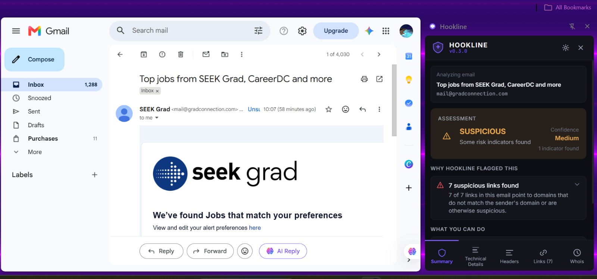

# Hookline

Hookline is a browser extension that helps identify phishing emails, suspicious links, and deceptive domains by analyzing common security indicators and explaining why something may be risky.

The goal of the project is not to replace enterprise security tools, but to help users better understand the signals often used to identify phishing attempts and malicious websites.

---

## Why I Built It

I built Hookline because I wanted a project that combined cybersecurity and software engineering in a practical way.

While learning about phishing attacks, I became interested in how attackers use techniques such as typosquatting, homoglyph attacks, brand impersonation, and recently registered domains to trick users.

Rather than building a tool that simply returns a warning, I wanted to build something that shows the evidence behind the assessment so users can understand what was detected.

---

## Features

### Website Analysis

* Typosquatting detection
* Homoglyph detection
* Brand impersonation checks
* Suspicious URL pattern detection
* Domain age analysis
* SSL certificate inspection

### Email Analysis

* SPF validation checks
* DKIM validation checks
* Reply-To mismatch detection
* Sender validation checks
* Link extraction and analysis

### Explainable Results

Hookline presents findings as evidence rather than a simple warning.

Example:

```text
Domain: paypal-security.com

Created: 3 days ago

SPF: Failed

DKIM: Missing

Reply-To: support@paypa1-security.com

Links Found: 4

Suspicious Links: 3

Assessment: High Risk
```

---

## Tech Stack

### Frontend

* React
* TypeScript
* Tailwind CSS

### Extension

* Chrome Extension Manifest V3

### Backend

* Python
* FastAPI

---

## Project Structure

```text
hookline/
├── extension/
├── backend/
├── docs/
├── README.md
└── .gitignore
```

---

## Getting Started

### Clone the Repository

```bash
git clone https://github.com/yourusername/hookline.git
cd hookline
```

### Backend Setup

Create and activate a virtual environment:

```bash
python -m venv .venv
```

Windows:

```bash
.venv\Scripts\activate
```

Mac/Linux:

```bash
source .venv/bin/activate
```

Install dependencies:

```bash
pip install -r requirements.txt
```

Start the backend:

```bash
uvicorn main:app --reload
```

### Extension Setup

Install frontend dependencies:

```bash
npm install
```

Build the extension:

```bash
npm run build
```

Load the generated extension through:

```text
chrome://extensions
```

Enable Developer Mode and select **Load unpacked**.

---

## Screenshots

### Extension Sidebar



---

## What I Learned

Some of the areas explored while building Hookline include:

* Browser extension development
* Manifest V3 architecture
* Email authentication standards (SPF, DKIM, DMARC)
* Phishing detection techniques
* Domain analysis
* Security-focused user experience design
* Frontend and backend integration

---

## Future Improvements

Planned areas for improvement include:

* Additional phishing datasets
* Expanded testing coverage
* Improved domain reputation analysis
* Threat intelligence integrations
* Support for additional email providers
* Improved detection accuracy and explainability

---

## Disclaimer

Hookline is an educational cybersecurity project created for learning and portfolio purposes.

Results generated by the extension should be treated as indicators rather than definitive security judgments.

---

## License

MIT License
